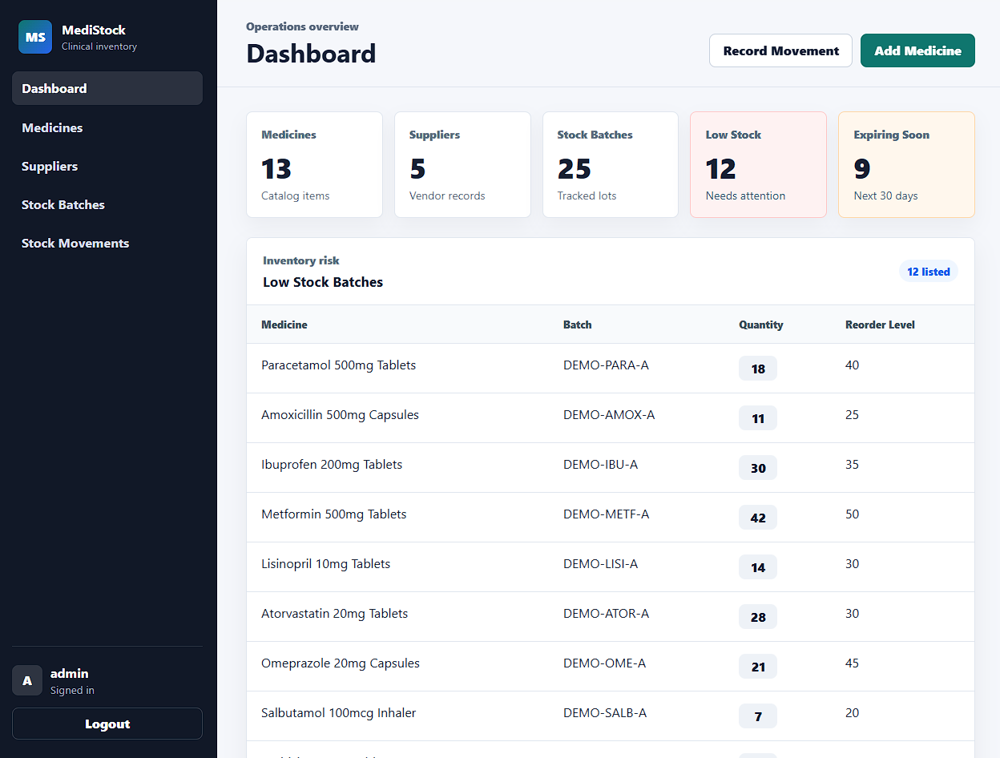
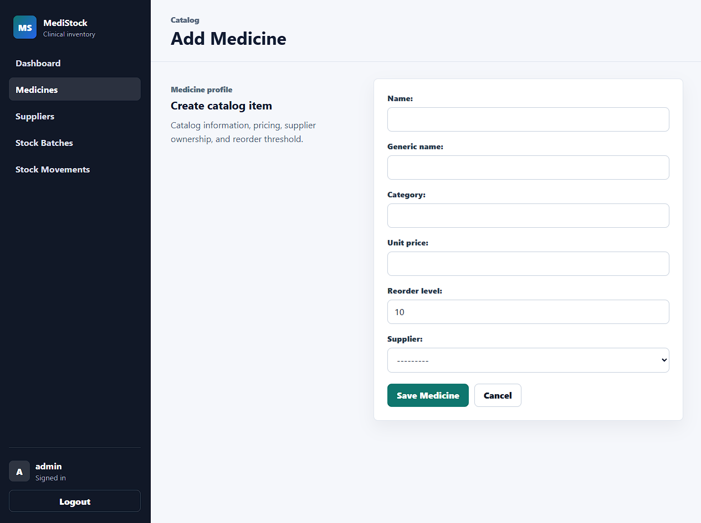

# MediStock

A Django inventory management system for clinical and pharmacy stock control. Staff can manage medicines, suppliers, stock batches, and stock movements from a protected dashboard, while tracking low stock items, expiring batches, and recent inventory activity.

## Screenshots

<div align="left">
  <p float="left">
    
    
  </p>
</div>

## Setup Instructions

```bash
git clone https://github.com/vfb-dev/medistock.git
cd medistock

python -m venv env
env\Scripts\activate

pip install -r requirements.txt
```

Create a PostgreSQL database, then add a `.env` file in the project root:

```env
SECRET_KEY=django-insecure-change-me
DEBUG=True
DB_NAME=medistock
DB_USER=postgres
DB_PASSWORD=your_password
DB_HOST=localhost
```

Run the database setup and start the development server:

```bash
python manage.py migrate
python manage.py createsuperuser
python manage.py seed_demo_data --reset-demo
python manage.py runserver
```

The demo seed command also creates a demo login by default:

```text
Username: demo
Password: demo12345
```

## Author

vfb-dev - Turning ideas into web apps
